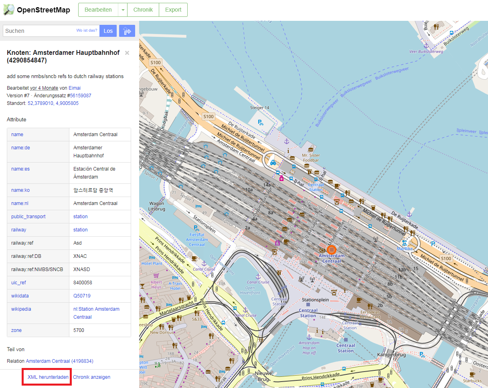

```{r setup, include=FALSE}
knitr::opts_chunk$set(echo = FALSE)
```


## [Download from OpenStreetMap](https://www.openstreetmap.org/)



## Parse XML to R

```{r,eval=F}
ghURL<-"https://www.openstreetmap.org/api/0.6/node/4290854847"
download.file(ghURL,"../data/amsterdamCentraal.osm")
```

```{r}
AMC <- xmlParse("../data/amsterdamCentraal.osm")
```


## See how data looks like

```{r}
AMC
```


## Download information for Amsterdam

```{r,eval=F}
ghURL2<-"https://www.openstreetmap.org/api/0.6/relation/47811"
download.file(ghURL2,"../data/amsterdam.osm")
```

```{r}
AM <- xmlParse("../data/amsterdam.osm")
```


## Use of `xpathApply`

```{r}
xpathApply(AM,"//tag[@k = 'population']")
```


