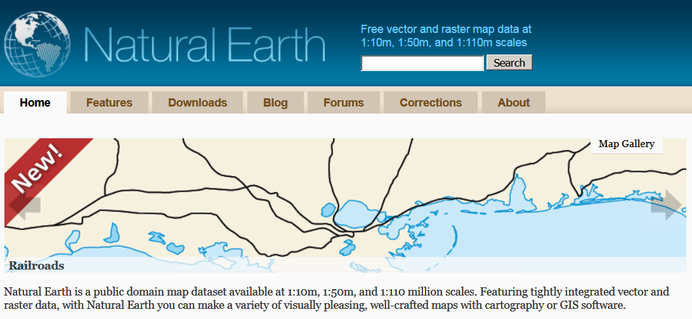

```{r setup_tmap, include=FALSE}
knitr::opts_chunk$set(echo = TRUE,warning=F,cache=F,fig.height=4,message=F)
```


## Inhalt dieses Abschnitts

- Das Paket `tmap` wird vorgestellt. 
- Die Datenquelle `naturalearthdata` wird vorgestellt.
- Es wird gezeigt, wie man Karten von Europa, der Welt und einzelnen Ländern erzeugen kann


```{r,echo=F,warning=F,message=F}
library(knitr)
library(DT)
Ex <- T
```

---


## Das Paket [tmap](https://cran.r-project.org/web/packages/tmap/index.html)

### Thematische Karten

- Mit dem Paket [**tmap**](http://twitter.com/sharon000/status/593028906820599808/photo/1?ref_src=twsrc%5Etfw) kann man thematische Karten erzeugen
- Die olgenden Beispiele basieren auf der [**Vignette**](https://cran.r-project.org/web/packages/tmap/vignettes/tmap-nutshell.html) des Paketes .

```{r,eval=F}
install.packages("tmap")
```


```{r,warning=F,message=F}
library(tmap)
```

---

## Der `World` Datensatz

### Natural Earth

- Datensatz enthält Informationen von  [**Natural Earth**](http://www.naturalearthdata.com/)

```{r}
data(World)
```



---

## Der Befehl `qtm` aus dem Paket `tmap`

### Schnelle thematische Karte

- Mit dem Befehl [**qtm**](https://cran.r-project.org/web/packages/tmap/vignettes/tmap-nutshell.html) kann man eine schnelle thematische Karte erzeugen

- Beispiel aus der [**Vignette**](https://cran.r-project.org/web/packages/tmap/vignettes/tmap-nutshell.html) zum Paket `tmap`

```{r}
qtm(World)
```

---


## Der World-Datensatz


```{r}
head(World)
```

---

## Um mehr Farbe in die Karte zu bekommen

### Entwicklungsstand der Wirtschaft

<!--
<http://www.naturalearthdata.com/>
-->
```{r,eval=Ex}
qtm(World, fill="economy")
```

---

## Eine Karte mit Text 

### Bevölkerung

```{r,eval=Ex}
qtm(World, fill="pop_est", text="iso_a3")
```

---

## Dieses Schema passt besser für [**GDP**](https://en.wikipedia.org/wiki/Population_density)

```{r,eval=Ex}
qtm(World, fill="gdp_cap_est", text="iso_a3", 
    text.size="AREA", root=5, fill.title="GDP per capita")
```

---

## Themen des Europa-Datensatzes

### Verfügbare Variablen im Datensatz

- [**ISO Klassifikation**](http://userpage.chemie.fu-berlin.de/diverse/doc/ISO_3166.html)
- Ländername
- Ist das Land Teil Europas? 
- Fläche, Bevölkerung, Bevölkerungsdichte, 
- [**Bruttoinlandsprodukt**](https://en.wikipedia.org/wiki/Gross_domestic_product)
- Bruttoinlandsprodukt [**zu Kaufkraftparitäten**](https://en.wikipedia.org/wiki/List_of_countries_by_GDP_%28PPP%29_per_capita)
- Ökonomie, Einkommensgruppe

---

## Die Variable `continent`

```{r}
qtm(World, fill="continent")
```

---

## Die Variable `area`

```{r}
qtm(World, fill="area") # Russia is huge
```

---

## Bevölkerung

```{r}
qtm(World, fill="pop_est",fill.title="Population") 
```

---

## Ökonomie

```{r}
qtm(World, fill="economy") 
```

---

## Einkommensgruppe

```{r}
qtm(World, fill="income_grp",fill.title="Income group") 
```

---

## Zwei Karten

### Bevölkerung und Entwicklungsstand

```{r,eval=T}
tm_shape(World) +
    tm_fill(c("pop_est", "economy"), 
        title=c("Population", "Economy"))
```

---

## Welt - Länder nach Einkommensgruppe

```{r}
qtm(World, fill="income_grp",fill.title="Income group") 
```

---

## Ein Datensatz zu den Provinzen in den Niederlanden (R-Paket `tmap`)

```{r}
data(NLD_prov)
qtm(NLD_prov)
```

---

## Niederlande - Bevölkerung in den Provinzen

```{r}
qtm(NLD_prov, fill="population",fill.title="population") 
```


---

## Bevölkerung der Gemeinden in den Niederlanden


```{r}
data(NLD_muni)
qtm(NLD_muni, fill="population") 
```


```{r,eval=F,echo=F}
?land
```

---

## Weltweite Flächennutzung

```{r}
data(land)
tm_shape(land,  relative=FALSE) +
    tm_raster("trees", title="Anteil Waldfläche")
```

---

## Räumliche Daten zu Metropolregionen


### [UN - World Urbanization Prospects 2018](https://population.un.org/wup/)

```{r}
data(metro)
head(metro)
```

---

## Nur ein Land visualisieren

```{r}
tm_shape(World[World$name=="Austria", ]) +
    tm_polygons()
```

---

## Beispieldaten laden

### Datenquelle Eurostat

- Daten zur Arbeitslosigkeit in Europa 

```{r}
url <- "https://raw.githubusercontent.com/Japhilko/
GeoData/master/2015/data/Unemployment07a13.csv"

Unemp <- read.csv(url) 
```

---


## Überblick über die Daten

```{r,warning=F,echo=F}
head(Unemp[1:10,])
```


## Exkurs: der Befehl `match`

### Zwei Beispielvektoren erstellen:

```{r}
vec_a <- c("A",2,6,1,"C")
vec_b <- c(1,"C",2)
```

---

## Die beiden Vektoren zusammen bringen

- Mit der Funktion `match` kann man schauen, welches Element des ersten Vektors sich im zweiten Vektor wiederfindet.

```{r}
match(vec_a,vec_b)
```


## Nutzung des Paketes `tmap` mit eigenen Daten

```{r,warning=F}
library("tmap")
data(World)
```

---


## Die Daten matchen

```{r}
data(World)
iso_a2<- substr(World$iso_a3,1,2)
ind <- match(iso_a2,Unemp$GEO)
World$Val2007M12 <- Unemp$Val2007M12[ind]
World$Val2013M01 <- Unemp$Val2013M01[ind]
```

---

## Eine Karte erzeugen

```{r}
qtm(World,c("Val2007M12","Val2013M01"))
```


```{r,eval=F,echo=F}
## Weltweite Flächennutzung

data(land)
data(World)
pal8 <- c("#33A02C", "#B2DF8A", "#FDBF6F", "#1F78B4", "#999999", "#E31A1C", "#E6E6E6", "#A6CEE3")
tm_shape(land, ylim = c(-88,88), relative=FALSE) +
    tm_raster("cover_cls", palette = pal8, title="Global Land Cover", legend.hist=TRUE, legend.hist.z=0) +
tm_shape(World) +
    tm_borders() +
tm_layout_World(inner.margins=0, 
    legend.text.size=1,
    legend.title.size=1.2,
    legend.position = c("left","bottom"), 
    legend.bg.color = "white", legend.bg.alpha=.2, 
    legend.frame="gray50", 
    legend.width=.2, legend.height=.6, 
    legend.hist.height=.2, 
    legend.hist.bg.color="gray60", legend.hist.bg.alpha=.5)
```

---

## Übung: Visualisierung von Eurostat Daten

### Erster Teil

- Verbinde die Statistik zur Sparquote mit den Kartendaten.
- Stelle die Daten in einer Karte dar.

### Zweiter Teil

- Such Daten, in denen der Ländername enthalten ist und versuche diesen Datensatz mit `tmap` zu visualisieren.

---

## Kleine und viele Karten

```{r}
tm_shape(World) +
    tm_fill("continent", thres.poly = 0) +
    tm_facets("name", free.coords=TRUE)
```


```{r,eval=F,echo=F}
# ## Die Entwicklungsversion des Paketes `tmap`
devtools::install_github("mtennekes/tmap/pkg", ref = "45855fa")
```


---

## Das Paket `tmap` zitieren

```{r}
citation("tmap")
```


