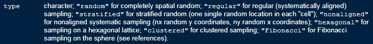
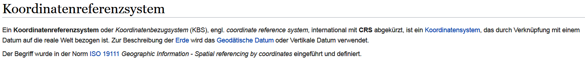

```{r setup_spdep, include=FALSE}
knitr::opts_chunk$set(echo = TRUE,cache=T,eval=T,warning=F,fig.height=6)
GESIS <- F
athome <- !GESIS
```


## Themen dieses Abschnitts

- Eine räumliche Stichprobe ziehen
- Adressen für die gezogenen Punkte bestimmen
- Adressdatensatz bereinigen
- Wie lässt sich die Entfernung bestimmen

### Das erste Gesetz der Geographie (TFLG)


> "All things are related, but nearby things are more related than distant things"
[Tobler, 1970]

---

## [Shapefile mit Regionalschlüssel](http://www.geodatenzentrum.de/geodaten/gdz_rahmen.gdz_div?gdz_spr=deu&gdz_akt_zeile=5&gdz_anz_zeile=1&gdz_unt_zeile=13&gdz_user_id=0) herunterladen

```{r,eval=GESIS,echo=F}
vg250path <- "J:/Work/GESISPanel_DATA/01_post_processing/c01/e_2017/ee/01_wave/data/com/geodata/vg250/"
```

```{r,eval=athome,echo=F}
vg250path <- "D:/GESIS/data/vg250_3112.utm32s.shape.ebenen/vg250_ebenen"
```


```{r}
library(rgdal)
```


```{r}
setwd(vg250path)
VG250 <- readOGR ("VG250_GEM.shp","VG250_GEM")
```

---

## [Räumliche Stichprobe](https://www.rdocumentation.org/packages/sp/versions/1.3-1/topics/spsample)

- Mit der Funktion `spsample` aus dem Paket `sp` kann man eine räumliche Stichprobe ziehen.

```{r}
spatsamp <- spsample(VG250, 100,type="random")
```



---

## Point in Polygon

- Mit der Funktion `over` kann man feststellen in welchem Polygon ein Punkt liegt.

```{r}
tmp <- sp::over(spatsamp, VG250)
```

```{r}
head(tmp[,1:6])
```

---

## Koordinatenreferenzsystem (CRS)

### [**CRS bei Wikipedia**]()

- Ein Koordinatenreferenzsystem ist ein Koordinatensystem, das durch Verknüpfung mit einem Datum auf die reale Welt bezogen ist.
- EPSG-Codes sind ein weit verbreitetes Mittel, um den räumlichen Bezug von Geodaten eindeutig anzugeben.
- Die 4- bis 5-stelligen Schlüsselnummern beinhalten jeweils eine komplette Beschreibung eines Koordinatenreferenzsystems.
-  Es gibt mehrere hundert solcher Referenzsysteme, und jedes besteht aus einer Liste von 10 bis 20 Parametern. 


<!--

-->

---

## Daten in ein anderes CRS übertragen

```{r,eval=F,echo=F}
library(sp)
```

> spTransform for map projection and datum transformation

<!--
# EPSG: 3857
-->

```{r}
newData<-sp::spTransform(spatsamp, CRS("+init=epsg:3857"))
```

```{r}
head(spatsamp)
head(newData)
```


<!--
# res <- spTransform(spatsamp, CRS("+proj=utm +zone=51 ellps=WGS84"))
-->

---

## Eine Karte von Afrika

```{r,warning=F,message=F}
library(maptools)
data(wrld_simpl)
Africa <- wrld_simpl[wrld_simpl@data$REGION==2,]
plot(Africa)
```

---

## Das Zentrum eines Polygonzuges

```{r}
Af <- coordinates(Africa)
head(Af)
```

---

## Die Koordinaten plotten

```{r,warning=F,message=F}
plot(Africa)
points(x=Af[1,1],y=Af[1,2],col="red",pch=20)
```


---

## Die nächsten Nachbarn finden

```{r,warning=F,message=F}
library(spdep)
Af_nb <- tri2nb(Af)
```

Die Nachbarn für das erste Land (Algerien):

```{r,warning=F,message=F}
Af_nb[1]
```

```{r}
Africa@data[Af_nb[[1]],1:5]
```

---

## Die Nachbarn finden

```{r,warning=F,message=F}
plot(Africa)
plot(Africa[1,],col="red",add=T)
plot(Africa[Af_nb[1][[1]],],col="orange",add=T)
```

---

## *k nearest neighbours*

```{r}
IDs <- row.names(as(Africa, "data.frame"))
(Af10_nb <- knn2nb(knearneigh(Af, k = 10), row.names = IDs))
```

---

## Die 10 nächsten Nachbarn finden

```{r,warning=F,message=F}
plot(Africa)
plot(Africa[1,],col="red",add=T)
plot(Africa[Af10_nb[1][[1]],],col="orange",add=T)
```

---

## Die Distanz berechnen

```{r,warning=F,message=F}
Af <- coordinates(Africa) # get centroid
library(raster)
pointDistance(Af[1:4,], lonlat=TRUE) # compute distance
```

---

## Berechnen/zeichnen einer Distanzmatrix

```{r Africa Distance,warning=F,message=F}
Dist_Af <- pointDistance(Af, lonlat=TRUE)
Af_color <- Dist_Af[,1]
Af_color <- Af_color/max(Af_color)
Af_color <- rgb(Af_color,0,0)
plot(Africa,col=Af_color)
```


---
## Übung - Nachbarschaften in London

<!--
https://github.com/Robinlovelace/Creating-maps-in-R
-->

- Lade den Datensatz london_sport von meinem Github Verzeichnis herunter.
- Importiere den Datensatz.
- Bestimme die nächsten Nachbarn des Stadtteils *City of London*

```{r}
setwd("D:/github/geocourse/data/")
london_sport <- readOGR ("london_sport.shp","london_sport")
```


```{r,eval=F,echo=F}
library(sf)
lnd <- read_sf("../data/london_sport.shp")
```

---

## Links

- [**Raster, CMSAF and solaR**](https://procomun.wordpress.com/2011/06/17/raster-cmsaf-and-solar/)

<https://procomun.wordpress.com/2011/06/17/raster-cmsaf-and-solar/>

- [**Getting rasters into shape from R**](https://johnbaumgartner.wordpress.com/2012/07/26/getting-rasters-into-shape-from-r/)

https://johnbaumgartner.wordpress.com/2012/07/26/getting-rasters-into-shape-from-r/