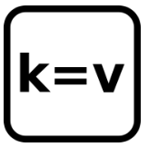
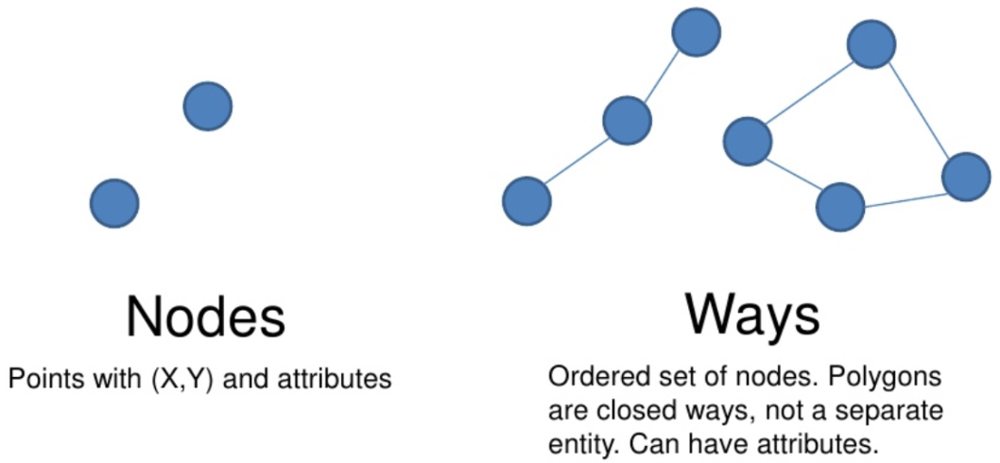
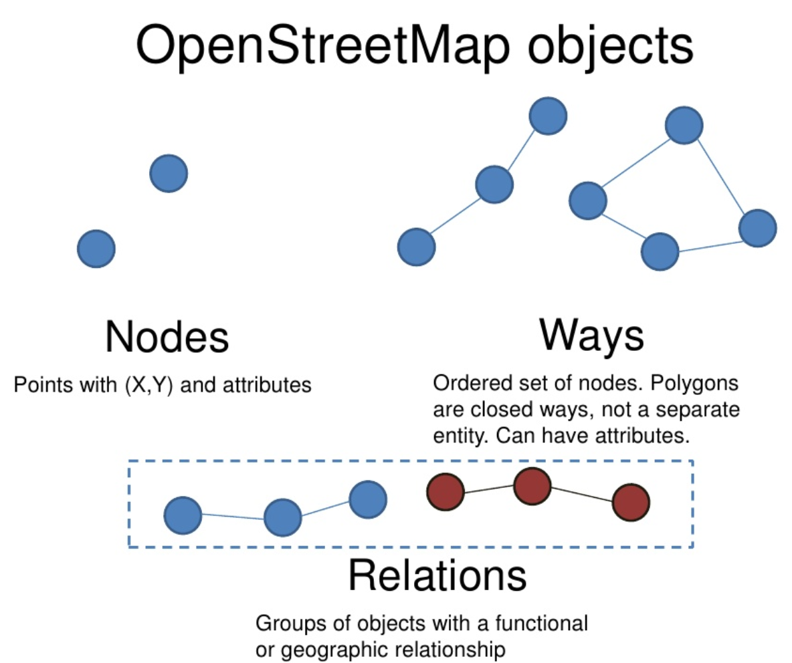
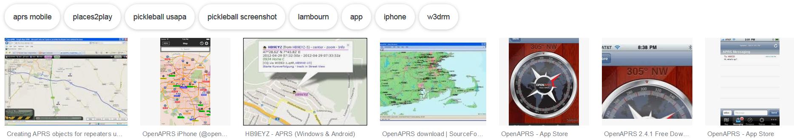
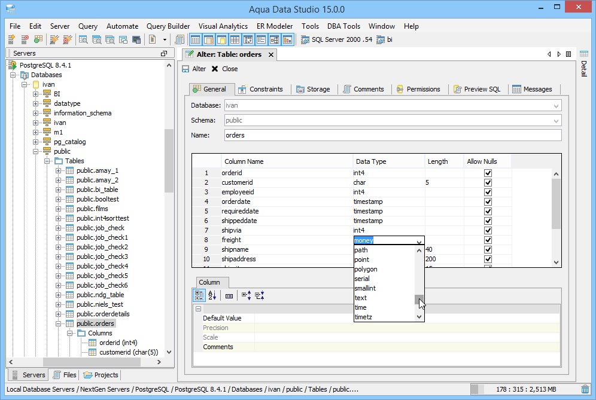
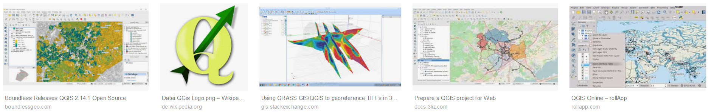
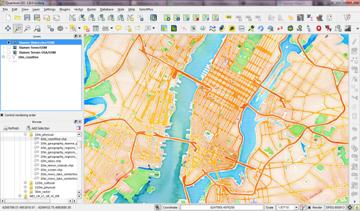

```{r setup_osm, include=FALSE}
knitr::opts_chunk$set(echo = TRUE,cache=T,eval=T,warning=F,message=F)
Ex <- T
```

## Inhalt dieses Abschnitts

- Vorstellung des Openstreetmap (OSM) Projekts
- Welche OSM-Daten sind erhältlich und wie kann man diese bekommen?
- Präsentation des Key-Value Schemas, dass bei OSM Daten verwendet wird.

<!--
- Vorstellung von Forschung die mit OSM-Daten durchgeführt wurde
-->

## [OpenStreetMap](http://www.openstreetmap.de/) Projekt

### http://www.openstreetmap.de/

> OpenStreetMap.org ist ein im Jahre 2004 gegründetes internationales Projekt mit dem Ziel, eine freie Weltkarte zu erschaffen. Dafür sammeln wir weltweit Daten über Straßen, Eisenbahnen, Flüsse, Wälder, Häuser und vieles mehr. 


## OpenStreetMap

### [**Wikipedia - OpenStreetMap**](https://en.wikipedia.org/wiki/OpenStreetMap)

> OpenStreetMap (OSM) ist ein kollaboratives Projekt um eine editierbare Weltkarte zu erzeugen.


## [Openstreetmap Tags](https://wiki.openstreetmap.org/wiki/Tags)



- Mit dem `key` wird eine Kategorie bezeichnet. 
- Der `value` wird zur Beschreibung der jeweiligen Form verwendet.
- So gibt es bspw. zahlreiche OSM-Objekte mit dem `key` highway. Dabei kann es sich bspw. um einen Fußweg (value=pathway) oder um eine Autobahn (value=motorway) handeln. 


## [OSM Map Features](http://wiki.openstreetmap.org/wiki/DE:Map_Features)


## Objekttypen in OSM

### Es gibt prinipiell drei verschiedene Objekttypen:

- Es gibt einfache nodes, also Punkte. Das kann bspw. eine Haltestelle des öffentlichen Nahverkehrs sein. 
- Der zweite Objekttyp sind Wege. Dadurch wird beispielsweise der Verlauf von Straßen oder Flüssen beschrieben.
- Der dritte Objekttyp sind Relationen. Dabei handelt es sich um eine Gruppierung von Objekten, die in einem logischen Zusammenhang stehen. 

<!--
- nodes (points), 
- ways (polygons and polylines)
- relations (logical grouping of all three object types
to express real-world geographical relationships)
-->

<!--
Es gibt prinipiell drei verschiedene Objekttypen. Es gibt einfache nodes, also Punkte. Das kann bspw. eine Haltestelle des öffentlichen Nahverkehrs sein. 

Der zweite Objekttyp sind Wege. Dadurch wird beispielsweise der Verlauf von Straßen oder Flüssen beschrieben. 

(points), 
- ways (polygons and polylines)
- relations (logical grouping of all three object types
to express real-world geographical relationships)
-->

Hippolyte Pruvost and Peter Mooney: Exploring Data Model Relations in OpenStreetMap


## OpenStreetMap objects

### [**Martijn van Exel**](https://www.slideshare.net/mvexel/openstreetmap-9819440) - nodes and ways


<!--

-->

## OpenStreetMap objects

### Relations


## Möglichkeiten die OSM-Daten zu bekommen

- Es gibt verschiedene Möglichkeiten die OSM-Daten zu bekommen. 
- Metro Extracts bietet rechteckige Ausschnitte für eine Stadt oder Region von Interesse auf der ganzen Welt.
- Grundsätzlich werden die Rohdaten im *Protocolbuffer Binary Format* (PBF)  oder im *Extensible Markup Language* (XML) Format angeboten. 
- Die [**Keyhole Markup Language**](https://de.wikipedia.org/wiki/Keyhole_Markup_Language) (KML) ist eine Auszeichnungssprache zur Beschreibung von Geodaten. Diese wurde bei Google Earth angewendet. KML befolgt die XML-Syntax.


## Download von OpenStreetMap Daten - [Metro extracts](https://mapzen.com/) 

- Ausschnitte von OpenStreetMap für einzelne Städte ([**metro extracts**](https://mapzen.com/data/metro-extracts/))


## Download von OpenStreetMap Daten - Geofabrik

### Geofabrik

- Eine Alternative zum Downlaod von großen OSM-Ausschnitten ist die [**Geofabrik**](http://download.geofabrik.de/)-Seite.  
- Hier lassen sich ebenfalls aktuelle Ausschnitte aber auch Shapefiles herunterladen.


<!--
Das shapefile Format ist ein beliebtes Format räumlicher Vektordaten für geographisches Informationssysteme (GIS). Das Dateiformat Shapefile ist ein ursprünglich für die Software ArcView der Firma ESRI entwickeltes Format für Geodaten.
-->

<!--
## Download von OpenStreetMap Daten - openaprs

### Kartendaten ([**openaprs**](http://www.openaprs.net/))


-->

## OSM Planet file

### Datenbanklösungen

- Bei den eben vorgestellten Möglichkeiten geht es vor allem um das Herunterladen kleiner Ausschnitte.
- Wenn größere Datenmengen benötigt werden, sollte man eine Datenbanklösung nutzen.
- [**PostgreSQL**](http://www.postgresql.org/) hat den Vorteil, dass es Open-Source ist.

## [Download PostreSQL](http://www.postgresql.org/download/windows/)

- [**Hier**](https://datashenanigan.wordpress.com/2015/05/18/getting-started-with-postgresql-in-r/) ist eine Einführung in PostgreSQL zu finden

<!--

-->


<!--
https://filehippo.com/de/download_postgresql/
http://www.postgresqltutorial.com/what-is-postgresql/
-->

## pgAdmin

- Sehr empfehlenswert: Arbeiten mit [**pgAdmin**](https://www.pgadmin.org/)
- Beispiel: um Verknüpfung zu einer Datenbank herzustellen - Doppelklick auf den Server in pgAdmin


## PostGIS für PostgreSQL

- [**Installieren**](http://postgis.net/install/) der PostGIS Erweiterung:

```
CREATE EXTENSION postgis;
```


## Programm zum Import der OSM Daten in PostgreSQL- osm2pgsql

- Läuft unter Linux deutlich besser
- so könnte bspw. ein Import in PostgreSQL aussehen:

```
osm2pgsql -c -d osmBerlin --slim -C  -k  berlin-latest.osm.pbf
```

## Verbindung zwischen R und Postrgesql

### [**Github Verzeichnis**](https://github.com/tomoakin/RPostgreSQL) zum Paket

```{r,eval=F}
install.packages("RPostgreSQL")
```

```{r}
library("RPostgreSQL")
```


## Nutzung von Quantum GIS

### [**QGIS**](https://www.qgis.org/de/site/) - Ein freies Open-Source-Geographisches-Informationssystem 

- Erstellen, bearbeiten, anzeigen, analysieren räumlicher Information unter Windows, Mac, Linux, BSD (bald auch Android) 
- Mit QGIS kann bspw auch der WMS/WCS oder WFS-Dienst des IÖR-Monitors genutzt werden. 




## Nutze bspw. [QGIS](http://www.qgis.org/de/site/) um Shapefiles zu extrahieren

- [Plugin OpenLayers](http://www.qgistutorials.com/de/docs/downloading_osm_data.html)


<!--
https://underdark.files.wordpress.com/2012/07/stamen_watercolor1.png?w=700
-->
```{r,echo=F}
library("knitr")
```


## Links

- [**Wiki zum Downlaod**](http://wiki.openstreetmap.org/wiki/Downloading_data) von Openstreetmap Daten

- Auf dem [**Openstreetmap Blog**](http://blog.openstreetmap.de/) gibt es wöchentlich neue Nachrichten zu OSM.

- Liste möglicher Datenquellen für räumliche Analysen ([weltweit](http://wiki.openstreetmap.org/wiki/Potential_Datasources) und in  [**Deutschland**](http://wiki.openstreetmap.org/wiki/DE:Potential_Datasources)
)


- Daten zu Administrative Grenzen kann man bei *Second Administrative Level Boundaries*  ([**SALB**](http://wiki.openstreetmap.org/wiki/SALB)) bekommen

<!--
<http://wiki.openstreetmap.org/wiki/SALB>
-->
