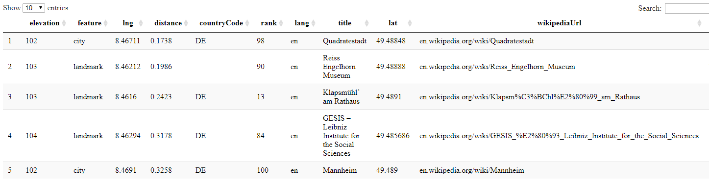

```{r setup_geokodierung, include=FALSE}
knitr::opts_chunk$set(echo = T,eval=T,message=F,warning=F)
osmEX <- T
library(knitr)
```

## Inhalt dieses Abschnitts

- Das Konzept der Geokoordinaten erklären
- Möglichkeiten vorstellen, die Geokodierung mit R durchzuführen
- Nutzung der Nominatim API

---


## Geokodierung

### [Wikipedia - Geocoding](https://github.com/adam-p/markdown-here/wiki/Markdown-Cheatsheet#blockquotes)


> Geocoding (...) uses a description of a location, most typically a postal address or place name, to find geographic coordinates from spatial reference data ... 


```{r,message=F,warning=F}
tmaptools::geocode_OSM("Mannheim")
```


---


##  [Longitude and latitude](https://keydifferences.com/difference-between-latitude-and-longitude.html)


---


## Geokodierung mit dem Paket `tmaptools`

- Beim Paket `tmaptools` wird die Nominatim API zur Geokodierung verwendet.
- Diese Funktion hat den Vorteil, dass eine Projektion ausgewählt werden kann, in der die Geokodierungen zurück gegeben werden. 

```{r}
library("tmaptools")
```


```{r,eval=F,echo=T}
?geocode_OSM
```

---

## Koordinaten verschiedener Orte in Deutschland

### Geokodierung mit einer Schleife

```{r,echo=T,message=F,eval=osmEX}
cities <- c("Hamburg","Koeln","Dresden","Muenchen")

lat <- vector()
lon <- vector()
for (i in 1:length(cities)){
  gc <- geocode_OSM(cities[i])
  lat[i] <- gc$coords[1]
  lon[i] <- gc$coords[2]
}
```

---

## Welche Koordinaten hat der Norden

```{r}
Dat <- data.frame(cities,lon,lat)
kable(Dat)
```


---

## Reverse Geokodierung

> Reverse geocoding is the process of back (reverse) coding of a point location (latitude, longitude) to a readable address or place name. This permits the identification of nearby street addresses, places, and/or areal subdivisions such as neighbourhoods, county, state, or country.

Quelle: [Wikipedia](https://en.wikipedia.org/wiki/Reverse_geocoding)


```{r,echo=F,eval=F}
library(tmap)
data(metro)
five_cities <- metro[sample(length(metro), 5), ]
```

```{r,echo=F,eval=F}
rev_geocode_OSM(x=48,y=8)
```


---

## Daten einlesen

- Hier wird ein Beispieldatensatz eingelesen, den ich über räumliche Stichproben und reverse geocoding erzeugt habe. 

```{r}
load("../data/addr_list_t_68239.RData")
head(addr_list_t)
```


```{r,eval=F,echo=F}
(load("../data/addr_list_t_Deutschland_samp1.RData"))
head(addr_list_t)
addr_dat <- data.frame(address = addr_list_t)
# gc_addr <- mutate_geocode(addr_dat, address)
```


---

## Die erste Adressen geokodieren


```{r}
geocode_OSM(addr_list_t[1])
```

---

## Alle Adressen geokodieren

- im Objekt `gc_list` werden die Ergebnisse gespeichert.

```{r,eval=F}
gc_list <- list()

for (i in 1:length(addr_list_t)){
  gc_list[[i]] <- geocode_OSM(addr_list_t[i])
}
```

---

## Geokodierung mit dem R-Paket `opencage`

- Um dieses Paket zu nutzen muss man sich vorher bei der API registrieren

```{r}
library(opencage)
```


```{r,eval=F}
gc_info<-opencage_forward(placename = 
                              "Amsterdam, Van Woustraat")
```

- Hinweise, wie das Paket genutzt erden kann sind im [**opencage Tutorial**](https://ropensci.org/tutorials/opencage_tutorial/) zu finden. 

---

## Das Paket [`geonames`](https://github.com/ropensci/geonames)

<!--
https://cran.r-project.org/web/packages/geonames/README.html
-->

```{r,eval=F,echo=F}
install.packages("geonames")
```

### Nutzung des `geonames` Paketes

- Ein Account ist notwendig um die meisten Funktionen des Paketes `geonames`zu nutzen.

```{r}
library(geonames)
```

```{r,eval=F}
options(geonamesUsername="myusername")
```

```{r,eval=F}
MAwiki<-GNfindNearbyWikipedia(postalcode=68239,country="DE",
                              radius=10)
```

```{r,eval=F,echo=F}
save(MAwiki,file="../data/MAwiki.RData")
```

---

## Beispiel Geonames 

### Wikipediaeinträge in der Nähe

```{r,echo=F,eval=F}
load("../data/MAwiki.RData")
library(knitr)
kable(MAwiki)
```

```{r,eval=F,echo=F}
DT::datatable(MAwiki[,-which(colnames(MAwiki)%in%c("summary"))])
```


- [**Login**](http://www.geonames.org/login) für die Nutzung des Web-Services Geonames.

- [**Hier**](http://www.geonames.org/enablefreewebservice) kann man das Arbeiten mit dem Webservice starten.

- [**Informationen zum Download bei Geonames**](http://www.geonames.org/export/ws-overview.html)




---

## Eine Bounding Box erstellen 

```{r}
library(osmdata)
bbox <- getbb("Mannheim")
```

<!--
x -lon - ost-West Richtung
-->

```{r,eval=F}
erg <- geonames::GNcities(49.649591,8.627236,
                          49.329591,8.307236)
```

<!--
https://cengel.github.io/rspatial/5_Geocoding.nb.html
http://www.datasciencetoolkit.org/

https://github.com/cengel/ArcGIS_geocoding
-->

---

## Geokodieren mit der API Nominatim

### Zunächst muss der Link erzeugt werden

```{r,eval=T}
library("RJSONIO")
api_adress <- "http://nominatim.openstreetmap.org/search?format="
file_format <- "json"
search_query <- "&addressdetails=1&extratags=1&q="
adress <- "Amsterdam+Niederlande+Rozengracht+1"

link <- paste0(api_adress,file_format,search_query,adress)
link
```

---

## Der Download mit Nominatim

```{r,eval=F}
con <- url(link)
geoc <- fromJSON(paste(readLines(con,warn=F), 
                       collapse = ''))
close(con)
```


```{r,eval=F,echo=F}
link <- "http://nominatim.openstreetmap.org/search?format=json&addressdetails=1&extratags=1&q=Amsterdam+Niederlande+Rozengracht+1"

save(geoc,file="../data/Amsterdam_Rozengracht.RData")
```

---

## So sieht das Ergebnis aus

```{r,eval=T,echo=F}
load("../data/Amsterdam_Rozengracht.RData")
```


```{r}
names(geoc[[1]])
```


```{r}
geoc[[1]]$address
```

---

## Das Paket `jsonlite` nutzen

```{r,eval=F,echo=T}
con <- url("http://nominatim.openstreetmap.org/search?format=json&
           addressdetails=1&extratags=1&q=Amsterdam+Niederlande+Rozengracht+1")
geoc2 <- jsonlite::fromJSON(con)

geoc2df <- with(geoc2,data.frame(osm_id,lat,lon))
geoc2df$house_number <-  geoc2$address$house_number
```

```{r,eval=F,echo=F}
save(geoc2df,file="../data/Amsterdam_Rozengracht_geoc2df.RData")
```


```{r,echo=F}
load("../data/Amsterdam_Rozengracht_geoc2df.RData")
```

Wir erhalten nun Daten für mehrere Anschriften:

```{r,echo=F}
kable(geoc2df)
```

```{r,eval=F,echo=F}
library(xtable)
xtable(geoc2df)
```


```{r,eval=F,echo=F}
geoc3 <- data.frame(geoc2)
DT::datatable(geoc2df)
```

---

## Das Paket `googleway`

> Accesses Google Maps APIs to Retrieve Data and Plot Maps

```{r,eval=F,echo=F}
install.packages("googleway")
```

```{r}
library(googleway)
```

- Ein [**API Schlüssel**](https://developers.google.com/maps/documentation/javascript/tutorial) ist notwendig um die meisten Funktionen des Paketes zu nutzen. 
- In der [**Vignette zum Paket**](https://cran.r-project.org/web/packages/googleway/vignettes/googleway-vignette.html#api-key) ist zu sehen, wie man das Paket nutzen kann.


<!--
https://developers.google.com/maps/documentation/javascript/get-api-key
-->

```{r,eval=F,echo=F}
install.packages("rgeolocate")
# install.packages("ipapi")
install.packages("geoparser")
install.packages("geosapi")
```

<!--
Abschnitt zu Geocoding in diesem Task View:

https://cran.r-project.org/web/views/WebTechnologies.html
-->


```{r,eval=F,echo=F}
library(devtools)
install_github("trestletech/rydn")
devtools::install_github("hrbrmstr/ipapi") # https://github.com/hrbrmstr/ipapi/
devtools::install_github("erzk/PostcodesioR") # https://github.com/ropensci/PostcodesioR/
```

---

## Das Paket `bbox` 

- Das Paket `bbox` ist auf github zu finden.

```{r,eval=F,echo=F}
devtools::install_github("ropensci/bbox") # https://github.com/ropensci/PostcodesioR/
```

- Beispieldatensatz laden:

```{r}
load("../data/ddat.RData")
```


<!--
https://github.com/ropensci/bbox
-->


---

## Links

- Überblick von Jesse Sadler zur [**Geokodierung mit R**](https://www.jessesadler.com/post/geocoding-with-r/)
- Ein Schummelzettel für [**`ggmap`**](https://www.nceas.ucsb.edu/~frazier/RSpatialGuides/ggmap/ggmapCheatsheet.pdf)
- Die Vignette zum Paket `tmap` - [**tmap: get started**](https://cran.r-project.org/web/packages/tmap/vignettes/tmap-getstarted.html)

- [**latlong.net**](https://www.latlong.net/place/hamburg-germany-8766.html) - eine Homepage um Koordinaaten zu bestimmen.


## Code Chunk - `tmaptools`


```{r gcBrouwersstraat}
library("tmaptools")
gc_tma <- tmaptools::geocode_OSM("Amsterdam, Buiten Brouwersstraat")
gc_tma
```

## Geocoding `ggmap`


```{r gcBrouwersstraatggmap}
library("ggmap")
gc_ggm <- ggmap::geocode("Amsterdam, Buiten Brouwersstraat")
gc_ggm
```

```{r,echo=F,eval=F}
save(gc_ggm,file="../data/gc_ggm.RData")
```


## Changing the projection

- [EPSG:4326](http://spatialreference.org/ref/epsg/wgs-84/)

```{r,echo=F}
load("../data/gc_ggm.RData")
```

```{r,eval=F}
install.packages("data.table")
```

If we work with simple features we can use the function `st_transform` from package `sf`.

```{r}
library(data.table)
library(sf)
DT <- data.table(longitude=gc_ggm$lon,
           latitude=gc_ggm$lat)

DT_sf = st_as_sf(DT, coords = c("longitude", "latitude"), 
                 crs = 3857, agr = "constant")
hrr_sf2 = st_transform(DT_sf, "+init=epsg:4326")
```


```{r}
library(rgdal)
coordinates(gc_ggm) <- c("lat", "lon")
proj4string(gc_ggm) <- CRS("+init=epsg:3857")
gc_ggm_t <- rgdal::spTransform(gc_ggm, CRS("+init=epsg:4326"))
```

## Projection with the `mapmisc` package

```{r,eval=F}
install.packages("mapmisc")
```


```{r}
library(mapmisc)
```


## Links

- [Changing the Projection of Shapefile](https://stackoverflow.com/questions/39979726/changing-the-projection-of-shapefile)

- [First vignette R-package `sf`](https://cran.r-project.org/web/packages/sf/vignettes/sf1.html)

- [Projecting sp objects in R](https://gis.stackexchange.com/questions/31743/projecting-sp-objects-in-r)

- [Lon-Lat to Simple Features (sfg and sfc) in R](https://gis.stackexchange.com/questions/222978/lon-lat-to-simple-features-sfg-and-sfc-in-r)

- [EPSG 3857 or 4326 for GoogleMaps, OpenStreetMap and Leaflet](https://gis.stackexchange.com/questions/48949/epsg-3857-or-4326-for-googlemaps-openstreetmap-and-leaflet)

<!--
https://gis.stackexchange.com/questions/48949/epsg-3857-or-4326-for-googlemaps-openstreetmap-and-leaflet

https://gis.stackexchange.com/questions/222978/lon-lat-to-simple-features-sfg-and-sfc-in-r

https://cran.rstudio.com/web/packages/mapsapi/vignettes/intro.html

https://www.shanelynn.ie/massive-geocoding-with-r-and-google-maps/

https://cran.r-project.org/web/packages/sf/vignettes/sf1.html#crs

https://cran.r-project.org/web/packages/sf/vignettes/sf1.html

https://gis.stackexchange.com/questions/31743/projecting-sp-objects-in-r

http://r.789695.n4.nabble.com/spTransform-longlat-to-utm-td4646641.html

https://stackoverflow.com/questions/39979726/changing-the-projection-of-shapefile   
-->
