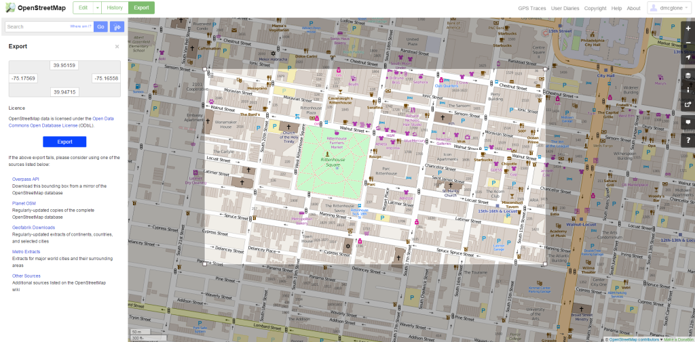
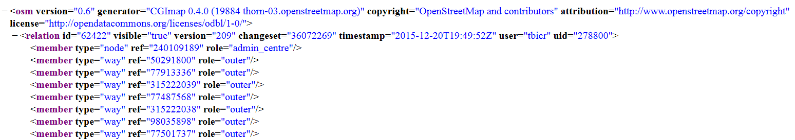
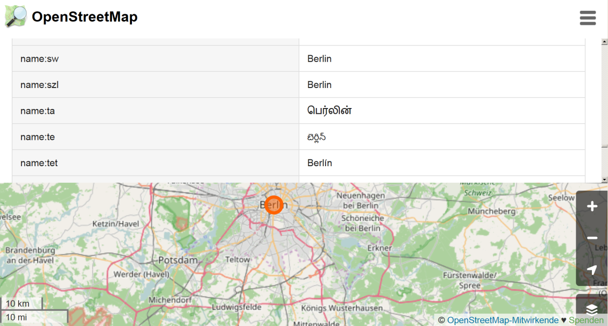
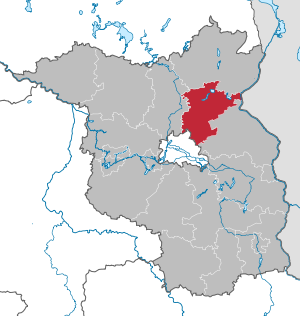

```{r setup_mainosmapi, include=FALSE}
knitr::opts_chunk$set(echo = TRUE)
library(knitr)
Ex <- T
```


## [OSM Ausschnitte herunterladen](http://www.openstreetmap.org/export)

<www.openstreetmap.org/export>




## Das R-Paket `XML` - Gaston Sanchez

```{r}
library("XML")
```

### Gaston Sanchez - Dataflow


Seine Arbeit sieht man [**hier**](http://gastonsanchez.com/).


## [Das Arbeiten mit XML Daten](https://github.com/gastonstat/tutorial-R-web-data/blob/master/04-parsing-xml/04-parsing-xml.pdf)


## Funktionen im XML Paket

```{r,echo=F,eval=T}
names <- c("xmlName()","name of the node","xmlSize()","number of subnodes","xmlAttrs()","named character vector of all attributes","xmlGetAttr()","value of a single attribute","xmlValue()","contents of a leaf node","xmlParent()","name of parent node","xmlAncestors()","name of ancestor nodes","getSibling()","siblings to the right or to the left","xmlNamespace()","the namespace (if there’s one)")
tab <- data.frame(t(array(names,dim=c(2,length(names)/2))))
colnames(tab) <- c("Function","Description")
kable(tab)
```


## [Einzelne Objekte finden](http://www.openstreetmap.org/export)

<www.openstreetmap.org/export>


## Beispiel: administrative Grenzen Berlin

[Administrative Grenzen für Deutschland](http://wiki.openstreetmap.org/wiki/DE:Grenze#Bundesl.C3.A4ndergrenze_-_admin_level.3D4)

```{r,echo=T}
url <- "https://api.openstreetmap.org/api/0.6/relation/62422"
```

```{r,echo=F,eval=F}
 library(xml2)
 BE <- xml2::read_xml.raw(url)
```


```{r,eval=F}
BE <- xmlParse(url)
```

```{r}
BE <- xmlParse("../data/62422.xml")
```




## Das XML analysieren

- [Tobi Bosede - Working with XML Data in R](http://www.informit.com/articles/article.aspx?p=2215520)

```{r,eval=Ex}
xmltop = xmlRoot(BE)
class(xmltop)
xmlSize(xmltop)
xmlSize(xmltop[[1]])
```


## Nutzung von Xpath

> [Xpath](https://de.wikipedia.org/wiki/XPath), the XML Path Language, is a query language for selecting nodes from an XML document. 

```{r,eval=Ex}
xpathApply(BE,"//tag[@k = 'population']")
```


## Quelle für die Bevölkerungsgröße

```{r}
xpathApply(BE,"//tag[@k = 'source:population']")
```

-[**Statistik Berlin Brandenburg**](https://www.statistik-berlin-brandenburg.de/datenbank/inhalt-datenbank.asp)

## Etwas überraschend: 

```{r}
xpathApply(BE,"//tag[@k = 'name:ta']")
```



## Geographische Region

```{r}
region <- xpathApply(BE,
  "//tag[@k = 'geographical_region']")
# regular expressions
region[[1]]
```

```
<tag k="geographical_region" 
  v="Barnim;Berliner Urstromtal;
  Teltow;Nauener Platte"/>
```

## Landkreis




## Weiteres Beispiel

```{r,eval=F}
url2<-"http://api.openstreetmap.org/api/0.6/node/25113879"
obj2<-xmlParse(url2)
obj_amenity<-xpathApply(obj2,"//tag[@k = 'amenity']")[[1]]
obj_amenity
```

```{r,echo=F}
obj2<-xmlParse("../data/25113879.xml")
obj_amenity<-xpathApply(obj2,"//tag[@k = 'amenity']")[[1]]
obj_amenity
```


## Wikipedia Artikel

```{r}
xpathApply(obj2,"//tag[@k = 'wikipedia']")[[1]]
```

```{r,eval=F}
xpathApply(obj2,"//tag[@k = 'wheelchair']")[[1]]
```

```{r,eval=F}
xpathApply(obj2,"//tag[@k = 'name']")[[1]]
```


## Das C und das A

```{r,eval=F}
url3<-"http://api.openstreetmap.org/api/0.6/node/303550876"
obj3 <- xmlParse(url3)
xpathApply(obj3,"//tag[@k = 'opening_hours']")[[1]]
```

```{r,echo=F}
obj3 <- xmlParse("../data/303550876.xml")
xpathApply(obj3,"//tag[@k = 'opening_hours']")[[1]]
```


## Hin und weg

```{r,eval=F }
url4<-"http://api.openstreetmap.org/api/0.6/node/25439439"
obj4 <- xmlParse(url4)
xpathApply(obj4,"//tag[@k = 'railway:station_category']")[[1]]
```

```{r,echo=F }
obj4 <- xmlParse("../data/25439439.xml")
xpathApply(obj4,"//tag[@k = 'railway:station_category']")[[1]]
```


- [**Wikipedia Artikel Bahnhofskategorien**](https://de.wikipedia.org/wiki/Bahnhofskategorie)


## Exkurs: Bahnhofskategorien

- [**rvest: Easily Harvest (Scrape) Web Pages**](https://cran.r-project.org/web/packages/rvest/index.html)

```{r}
library(rvest)
bhfkat<-read_html(
  "https://de.wikipedia.org/wiki/Bahnhofskategorie")
df_html_bhfkat<-html_table(
  html_nodes(bhfkat, "table")[[2]],fill = TRUE)
```

## Bahnhofskategorien Übersicht

```{r,echo=F}
library(knitr)
kable(df_html_bhfkat)
```

## Nur fliegen ist schöner

```{r,eval=F}
url5<-"http://api.openstreetmap.org/api/0.6/way/162149882"
obj5<-xmlParse(url5)
xpathApply(obj5,"//tag[@k = 'name']")[[1]]
```

```{r,echo=F}
obj5<-xmlParse("../data/162149882.xml")
xpathApply(obj5,"//tag[@k = 'name']")[[1]]
```


```{r}
xpathApply(obj5,"//tag[@k = 'website']")[[1]]
```


```{r}
xpathApply(obj5,"//tag[@k = 'iata']")[[1]]
```

## Das Paket `osmar` benutzen

```{r}
library("osmar")
node_ <- xmlParse("../data/162149882.xml")
node_osmar <- as_osmar(node_)
node_osmar
```

## [Drei Typen von Vektorobjekten](https://www.earthdatascience.org/courses/earth-analytics/spatial-data-r/intro-vector-data-r/)

<!--
https://www.earthdatascience.org/courses/earth-analytics/spatial-data-r/intro-vector-data-r/
-->


## Die Ausdehnung


## [Import mit dem Paket `sf`](https://cran.r-project.org/web/packages/sf/vignettes/sf2.html)


```{r eval=T}
library(sf)
```

- Mit dem Befehl `st_layers` kann man sehen, welche Layer verfügbar sind:

```{r}
st_layers("../data/Amsterdam_highway_primary.osm")
```

## Import von Layer `lines`

```{r}
dat <- st_read("../data/Amsterdam_highway_primary.osm",
               "lines")
```

## Den Layer plotten

```{r}
plot(dat$geometry)
```


## Import von Layer `points`

```{r}
datp <- st_read("../data/Amsterdam_highway_primary.osm",
                "points")
```

## Den Layer `points` plotten

```{r}
plot(dat$geometry,pch=20,col=rgb(0,0,1,.1))
```


## Mit einem anderen Paket plotten

```{r}
library(tmap)
qtm(dat$geometry)
```

## 

```{r}
st_layers("../data/ams_centraal.osm")
```

```{r}
datm <- st_read("../data/ams_centraal.osm","multipolygons")
sp::plot(datm$geometry)
```


## Mehr Beispiele, wie man mit XML Daten umgeht:

- Deborah Nolan - [**Extracting data from XML**](http://www.stat.berkeley.edu/~statcur/Workshop2/Presentations/XML.pdf)
- Duncan Temple Lang - [**A Short Introduction to the XML package for R**](http://www.omegahat.net/RSXML/shortIntro.pdf)


### Noch mehr Informationen

- [**Web Daten manipulieren**](http://www.di.fc.ul.pt/~jpn/r/web/index.html#parsing-xml)

- [**Tutorial zu xquery**](http://www.w3schools.com/xml/xquery_intro.asp)

- [**R und das Web (für Anfänger), Teil II: XML und R**](http://giventhedata.blogspot.de/2012/06/r-and-web-for-beginners-part-ii-xml-in.html)

- Gaston Sanchez - [**String Manipulation**](http://gastonsanchez.com/Handling_and_Processing_Strings_in_R.pdf)

- [**Nutzung, Vor- und Nachteile OSM**](https://www.e-education.psu.edu/geog585/node/738)

- [**Forschungsprojekte im Zusammenhang mit OpenStreetMap**](http://wiki.openstreetmap.org/wiki/Research)

## Referenzen

```{r}
citation("XML")
```

## Das neuere Paket

```{r}
citation("xml2")
```


<!--
https://cran.r-project.org/web/packages/XML2R/XML2R.pdf
-->


```{r eval=FALSE, include=FALSE}
library(sf)
dat <- st_read("../data/162149882.xml")
dat <- st_read("../data/Amsterdam_highway_primary.osm")
```

