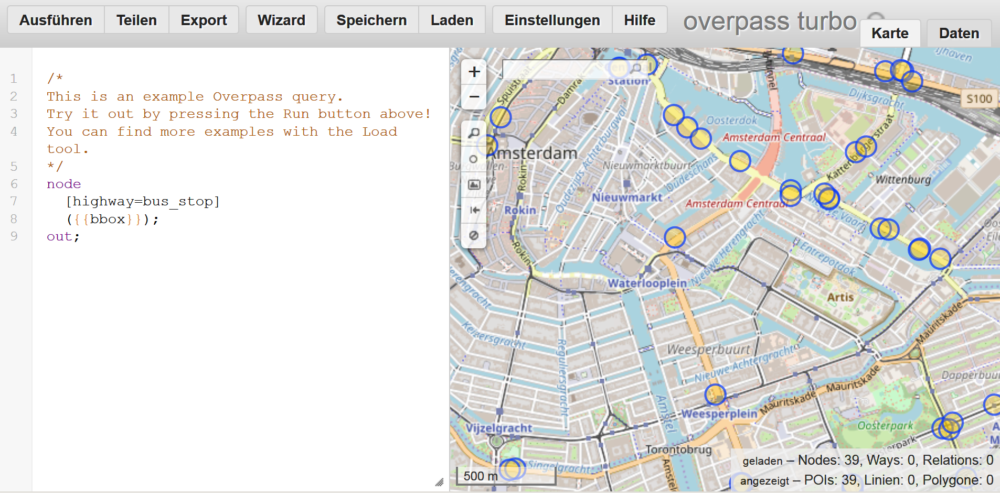
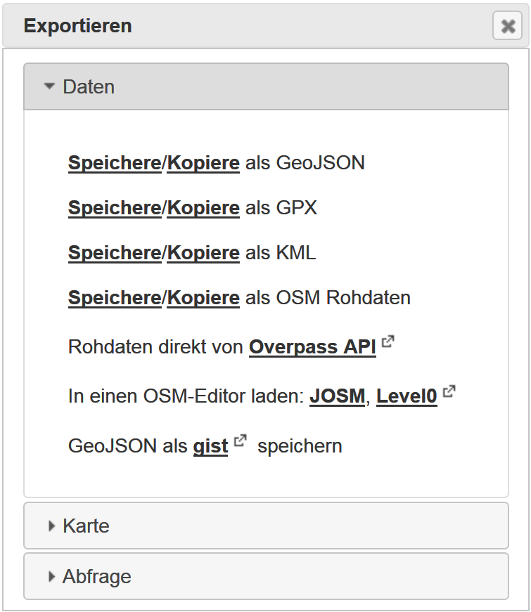
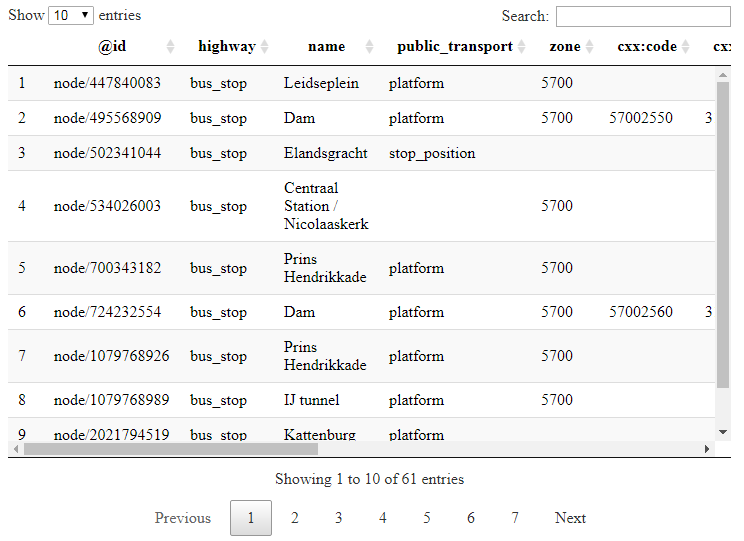
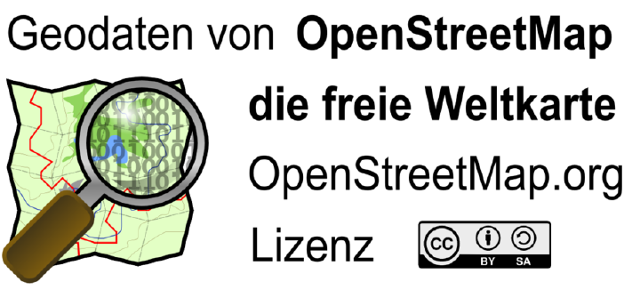
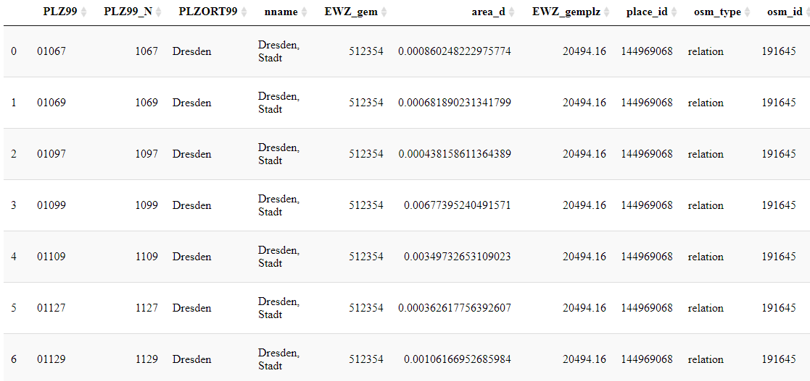
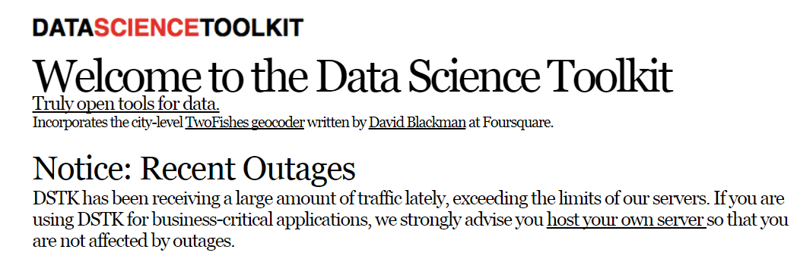

```{r setup, include=FALSE}
knitr::opts_chunk$set(echo = TRUE,fig.height=4)
library(knitr)
GESIS <- F
athome <- !GESIS
```

## Themen dieses Abschnitts

- Die [**Overpass API**](https://wiki.openstreetmap.org/wiki/Overpass_API) von Roland Olbricht wird vorgestellt.
- Die API [**Overpass Turbo**](https://overpass-turbo.eu/)
- Wie man die OSM Daten graphisch darstellen kann.

---


## Die Overpass API

<!--
This API is perfect to download data on very particular topics.

Wenn man beispielsweise nach speziellen Map Features sucht.
-->

- Die von Roland Olbricht geschriebene Overpass API ermöglicht es Entwicklern, kleine Auszüge von benutzergenerierten Inhalten von Openstreetmap nach vorgegebenen Kriterien herunterzuladen.
- Overpass ist eine read-only API, die durch den Benutzer ausgewählte Teile der OSM-Daten bereitstellt. 
- Overpass kann als eine Datenbank über das Internet verstanden werden.
- Die API eignet sich besonders gut, wenn man nach ganz speziellen Map Features sucht. 

<!--
Overpass is a read-only API that provides custom selected parts of the OSM data. 
It can be understood as a database over the web, it uses the fact that OSM is enriched with additional information ranging from city names to e.g. locations of street lamps or energy generators \citep{schmidt2013extraction}.
If it is the target, to get all bus stops in Amsterdam, then it is possible to download the information from Overpass Turbo (\url{https://overpass-turbo.eu/}), using the key highway and the value bus\_stop.
-->

---


## [Overpass Turbo](https://overpass-turbo.eu/)



---


## Query Overpass

- In der folgenden Abfrage wird bei Overpass Turbo nach Bars im ausgewählten Fenster gesucht. 

```
node
  [amenity=bar]
  ({{bbox}});
out;
```

---


## Export bei Overpass



---


## Speicherformate 

### Bei Export von Overpass

- GeoJSON
- GPX
- KML
- OSM Rohdaten

---


## Import von Daten

```{r}
library(XML)
dat <- xmlParse("../data/bus_stop_amsterdam.kml")
```

```{r}
xmltop <- xmlRoot(dat)
xmltop[[1]][[1]]
```

---


## Xpath Abfragesprache

### Beispiel: [xpath wikipedia](https://de.wikipedia.org/wiki/XPath)


```{r,echo=T}
xpathApply(dat,"Document")
```


---

## JSON importieren


```{r,eval=F}
install.packages("rjson")
library(rjson)
```

```{r}
library(jsonlite)
dat<-jsonlite::fromJSON("../data/amsterdam_busstop.geojson")
typeof(dat)
names(dat)
```

---

## Wie sehen die Daten aus


```{r,echo=F,eval=F}
kable(dat$features$properties[1:10,c(1,3:5)])
```

```{r,eval=F}
DT::datatable(dat$features$properties)
```



---

## GPX file importieren

```{r import_gpx, eval=FALSE, message=FALSE, warning=FALSE, include=FALSE}
install.packages("plotKML")
```

```{r}
library(plotKML)
dat_gpx <- readGPX("../data/Amsterdam_busstop.gpx")
head(dat_gpx$waypoints)
```

---


## Daten verbinden - Beispiel Bäckereien in Berlin

- Quelle für die folgenden Daten ist: 



<!--
http://wiki.openstreetmap.org/wiki/DE:Datenherkunft_richtig_angeben
-->

---

## OSM als Datenquelle

- Zum Download habe ich die [**Overpass API**](http://wiki.openstreetmap.org/wiki/Overpass_API) verwendet

```{r,eval=T,echo=T}
load("../data/info_bar_Berlin.RData")
```

```{r,echo=F}
info_be <- info[,c("addr.postcode","addr.street","name","lat","lon")]
```

```{r,echo=F}
kable(head(info_be))
```

---

## Verwendung des Pakets `gosmd`

```{r,eval=F}
devtools::install_github("Japhilko/gosmd")
```


```{r,eval=F}
library("gosmd")
pg_MA <- get_osm_nodes(object="leisure=playground","Mannheim")
pg_MA <- extract_osm_nodes(pg_MA,value='playground')
```

---

## Matching

```{r}
tab_plz <- table(info_be$addr.postcode)
```

```{r}
load("../data/BE.RData")
```


```{r}
ind <- match(BE@data$PLZ99_N,names(tab_plz))
head(ind)
```

### Daten anspielen

```{r}
BE@data$num_plz <- tab_plz[ind]
```

```{r,eval=F,echo=F}
install.packages("colorRamps")
install.packages("XML")
install.packages("geosphere")
install.packages("tmap")
install.packages("curl")
install.packages("R.oo")
```

---

## Eine Karte von Berlin mit dem Paket `tmap`

```{r}
BE@data$num_plz[is.na(BE@data$num_plz)] <- 0
tmap::qtm(BE,fill = "num_plz")
```

## Mehr Informationen einbinden

- Der folgende Datensatz ist eine Kombination aus den vorgestellten PLZ-Shapefiles und OSM-Daten die über Overpass heruntergeladen wurden:


```{r}
load("../data/osmsa_PLZ_14.RData")
```

```{r,echo=F,eval=F}
dat_plz <- PLZ@data
kable(head(dat_plz))
DT::datatable(dat_plz)
```



---

## OSM-Daten - Bäckereien in Stuttgart


```{r,echo=F}
PLZ_SG <- PLZ[PLZ@data$PLZORT99=="Stuttgart",]
```


```{r}
tmap::qtm(PLZ_SG,fill="bakery")
```

---

## [Das R-Paket `RDSTK`](http://www.datasciencetoolkit.org/)

```{r,eval=F,echo=F}
install.packages("RDSTK")
```



- Data Science Toolkit API

```{r,eval=F}
library("RDSTK")
```

---

## Die Daten für Stuttgart

```{r,echo=T}
tab_landcover <- table(PLZ_SG$land_cover.value)
df_landcover <- data.frame(tab_landcover)
colnames(df_landcover)[1] <- c("Type_landcover")
kable(df_landcover)
```

---

## Eine Karte der Flächenbedeckung erstellen

- Daten von [European Commission Land Resource Management Unit Global Land Cover 2000.](http://bioval.jrc.ec.europa.eu/products/glc2000/products.php)

```{r,message=F,warning=F}
tmap::qtm(PLZ_SG,fill="land_cover.value")
```

---

## Die Höhe in Stuttgart

- Daten von [**NASA and the CGIAR Consortium for Spatial Information **](http://srtm.csi.cgiar.org/)

```{r}
tmap::qtm(PLZ_SG,fill="elevation.value")
```

<!--
man könnte hier noch zeigen, wie man einen Punkt hinzufügen kann
-->

```{r,eval=F,echo=F}
# https://overpass-turbo.eu/
```

