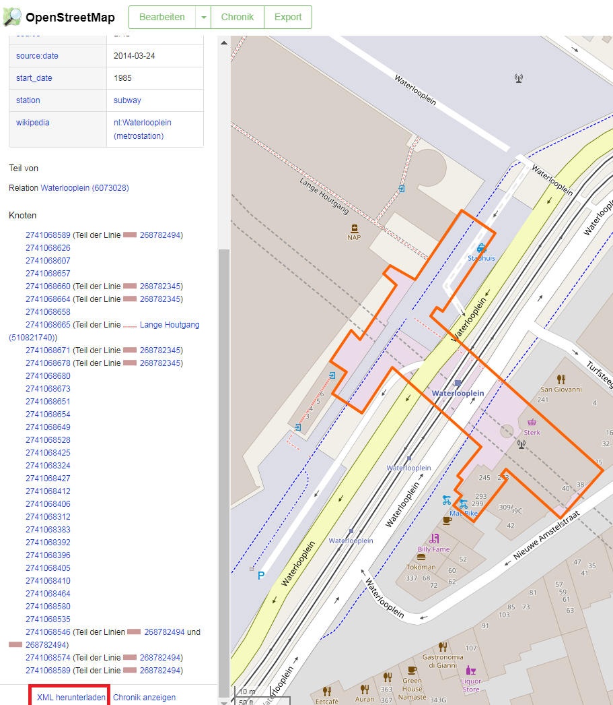

```{r, include=FALSE}
knitr::opts_chunk$set(echo = T,cache=T)
```

## Download information for one node

```{r}
library("osmar")
src <- osmsource_api()
```

```{r,echo=F,eval=F}
?osmsource_api
src <- osmsource_api(url = "http://api.openstreetmap.org/api/0.6/")
```


```{r mannheimnode}
mannheim <- get_osm(node(240060919))
```


## Manual download of information for one node

<https://www.openstreetmap.org/>



## Import information to R

```{r, eval=F,echo=F}
waterlooplein <- get_osm("../data/268782305.xml")
```


## Download information for a bounding box

```{r}
bb <- center_bbox(4.901761,52.36842,900 ,900)
ua <-get_osm(bb , source = src)
```


## [Problem with API](https://gis.stackexchange.com/questions/197914/r-and-osmar-the-docs-example-does-not-work-for-me-opening-and-ending-tag-mi)

```{r,eval=F,echo=F}
api <- osmsource_api()  
box <- corner_bbox(11.579341, 48.15102, 11.582852, 48.1530)  
osmar:::get_osm_data.api(api, box)
```

## [The r-package `osmar2`](https://github.com/gergness/osmar2)


```{r,eval=F}
devtools::install_github("gergness/osmar2")
```

```{r,echo=F,eval=F}
src <- osmar2::osmsource_api() 
mannheim <- osmar2::get_osm(node(240060919))
```


## Links

- [paleolimbot on GitHub](http://paleolimbot.github.io/tutorial/r-osmdata/r-osmdata.html)

- [Open Street Map: loading, analysing and visualising free maps with R and QGIS](https://rstudio-pubs-static.s3.amazonaws.com/12696_9fd49fb7055c40ff9b3a3ea740e13ab3.html)

- [Problems with osmar and API]("https://gis.stackexchange.com/questions/197914/r-and-osmar-the-docs-example-does-not-work-for-me-opening-and-ending-tag-mi")