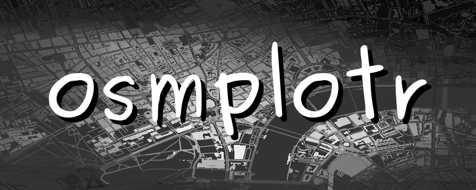

```{r setup, include=FALSE}
knitr::opts_chunk$set(echo = TRUE)
```

## [The R-package `osmplotr`](https://github.com/ropensci/osmplotr)

```{r}
install.packages("osmplotr")
```

```{r}
library("osmplotr")
library("maptools")
```




## Download information on buildings

- [OSM map features](https://wiki.openstreetmap.org/wiki/Map_Features)

```{r,eval=F}
bbox <- get_bbox(c (4.90, 52.36, 4.92, 52.37))
dat_ba <- extract_osm_objects(key='building', bbox=bbox)
```

```{r,eval=F,echo=F}
save(dat_ba,file="data/dat_ba.RData")
```


## Plot a first map

```{r,echo=F}
load("data/dat_ba.RData")
```


```{r}
map <- osm_basemap(bbox = bbox, bg = 'gray20')
map <- add_osm_objects(map, dat_ba, col = 'gray40')
print_osm_map(map)
```


## A larger map section

- attention: the data packagage gets quite big for bigger sections

```{r,eval=F}
bbox <- get_bbox(c (4.81, 52.00, 4.92, 53.00))
dat_ba <- extract_osm_objects(key='building', bbox=bbox)
```

```{r,echo=F,eval=F}
setwd("D:/Daten/Daten/GeoDaten")
save(dat_ba,file="osmplotr_amsterdam.RData")
```

```{r,echo=F,eval=F}
map <- osm_basemap(bbox = bbox, bg = c("#EEAD0E"))
map <- add_osm_objects(map, dat_ba, col = c("#00008B"))
print_osm_map(map)
```

## The bounding box

```{r,eval=F}
?osmplotr::get_bbox
```


```{r}
library(osmdata)
?osmdata::getbb
```

- [Select region by polygon](https://github.com/ropensci/osmdata/issues/80)

<!--
xxxxtodo: wie bekommt man einen guten Kartenausschnitt hin
-->

## Highways for Amsterdam

```{r}
bbox <- getbb("Amsterdam")
dat_ha <- extract_osm_objects(key='highway', bbox=bbox)
```


```{r,echo=F,eval=F}
save(dat_ha,file="D:/Daten/Daten/GeoDaten/osmplotr_amsterdam_hw.RData")
```

```{r,echo=F,eval=F}
map <- osm_basemap(bbox = bbox, bg = c("#EEAD0E"))
map <- add_osm_objects(map, dat_ha, col = c("#00008B"))
print_osm_map(map)
```

```{r,echo=F,eval=F}
pdf("slides/figure/adam_highways.pdf")
  print_osm_map(map)
dev.off()
```

## The result highways for Amsterdam


## [Adding more information to the map](https://cran.r-project.org/web/packages/osmplotr/vignettes/basic-maps.html)

```{r}
map <- add_osm_objects (map, dat_H, col = 'gray70', size = 0.7)
map <- add_osm_objects (map, dat_T, col = 'green', size = 2, shape = 1)
```


## data structure

```{r}
load("data/dat_ba.RData")
typeof(dat_ba)
names(dat_ba)
```

## A quick map with `tmap`

```{r, eval=F}
install.packages("tmap")
```


```{r}
library(tmap)
qtm(dat_ba$geometry,fill = "#8B1A1A")
```

## A further example

```{r}
bbox <- get_bbox(c (4.895154, 52.364376, 4.908368, 52.372464))
dat_ba <- extract_osm_objects(key='building', bbox=bbox)
```


## Links


- [osmplotr tutorial](https://ropensci.org/tutorials/osmplotr_tutorial/)

- [PDF manual of `osmplotr`](https://cran.rstudio.com/web/packages/osmplotr/osmplotr.pdf)

```{r,echo=F,eval=F}
install.packages("colourpicker")
# https://deanattali.com/blog/colourpicker-ggmarginal-gadgets/
```

<!--
Links

https://gisfirstaid.netlify.com/2017/08/30/osmplotr-maps/
https://ropensci.github.io/osmplotr/articles/data-maps.html
https://github.com/ropensci/osmplotr
-->